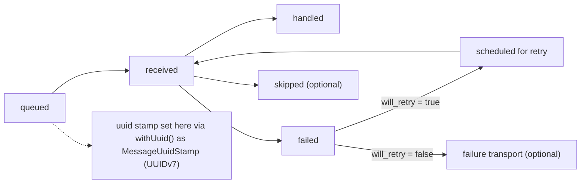

<p align="center">
  
</p>

# Messenger Logging Bundle

Symfony bundle focused on tracking individual Messenger messages end-to-end.

## Why This Bundle Exists

Symfony Messenger's internal logging is useful for worker-level diagnostics,
but it is not optimized for tracking a single message across queueing, retries,
failure transport, and final handling.

This bundle adds a stable `uuid` to each message and emits structured lifecycle
logs so one message can be followed reliably in your logging and monitoring
tools.

### Tracking Capabilities

- A UUIDv7 is assigned when a message is queued.
- The same UUID is reused across queueing, receiving, handling, failures,
  retries, and skips.
- Each log entry includes key tracking fields such as `message_class`,
  `retry_count`, receiver/transport names, and failure-transport metadata.
- Each log entry includes a normalized `stamps` array for additional envelope
  context.

### Supported Lifecycle Events

The bundle logs queueing, receiving, handled, failed, and retried events. If
the installed Messenger version supports `WorkerMessageSkipEvent`, skipped
messages are logged as well.

## Installation

### Package Installation

```bash
composer require ckrack/messenger-logging-bundle
```

### Bundle Registration

If you are not using Symfony Flex, register the bundle manually in
`config/bundles.php`.

### Supported Versions

The bundle targets Symfony `6.4`, `7.4`, and `8.0`.

## Configuration

### Basic Configuration

```yaml
ckrack_messenger_logging:
  enabled: true
  log_channel: messenger
  log_levels:
    queued: info
    received: info
    handled: info
    failed: error
    retried: warning
    skipped: warning
  stamp_normalizers: {}
```

### Log Levels

All PSR-3 log levels are supported. If failure logs are too noisy in a
retry-heavy environment, you can set `failed: info`.

### Dedicated Log Channel

If `log_channel` is set, only the logs emitted by this bundle are sent to that
Monolog channel. Other project logs remain unaffected unless they are
explicitly configured to use the same channel. Without `log_channel`, the
default logger behavior remains unchanged.

## Stamp Normalization

### Default Behavior

The bundle normalizes a safe subset of Messenger stamp data and includes it in
the `stamps` field of each log entry. Built-in normalizers cover
`BusNameStamp`, `DelayStamp`, `HandledStamp`, `RedeliveryStamp`,
`RouterContextStamp`, `SentStamp`, `TransportNamesStamp`, and
`ValidationStamp`.

Unknown stamps are still listed by class name, but their `context` remains
empty unless a normalizer is registered for them. This avoids reflecting every
public getter on every stamp, which can expose sensitive data or large payloads
such as handler results.

### Custom Normalizers

Custom normalizers are discovered automatically when they implement
`C10k\MessengerLoggingBundle\Logging\StampNormalizerInterface` and are
registered as autoconfigured services. The bundle tags them with
`ckrack_messenger_logging.stamp_normalizer` and maps them by supported stamp
class.

You can also wire an explicit `StampClass -> NormalizerClass` mapping via
configuration, which is useful for overrides:

```yaml
ckrack_messenger_logging:
  stamp_normalizers:
    App\Messenger\CustomStamp: App\Messenger\Logging\CustomStampNormalizer
```

## Tracked Lifecycle

### Lifecycle Flow



### Field Presence By Log Event

`skipped` is only logged when `WorkerMessageSkipEvent` is available in the
installed Messenger version.

| field | queued | received | handled | failed | retried | skipped |
| --- | --- | --- | --- | --- | --- | --- |
| `uuid (string/null)` | ✅ | ✅ | ✅ | ✅ | ✅ | ✅ |
| `message_class (class-string)` | ✅ | ✅ | ✅ | ✅ | ✅ | ✅ |
| `retry_count (int)` | ✅ | ✅ | ✅ | ✅ | ✅ | ✅ |
| `received_transport_names (list<string>)` | ✅ | ✅ | ✅ | ✅ | ✅ | ✅ |
| `from_failed_transport (bool)` | ✅ | ✅ | ✅ | ✅ | ✅ | ✅ |
| `failed_transport_original_receiver_name (string/null)` | ✅ | ✅ | ✅ | ✅ | ✅ | ✅ |
| `transport_message_id (string/null)` | ✅ | ✅ | ✅ | ✅ | ✅ | ✅ |
| `stamps (list<array{class: class-string, context: array<string, mixed>}>)` | ✅ | ✅ | ✅ | ✅ | ✅ | ✅ |
| `sender_names (list<string>)` | ✅ | ❌ | ❌ | ❌ | ❌ | ❌ |
| `receiver_name (string)` | ❌ | ✅ | ✅ | ✅ | ✅ | ✅ |
| `will_retry (bool)` | ❌ | ❌ | ❌ | ✅ | ❌ | ❌ |
| `exception_class (class-string<Throwable>)` | ❌ | ❌ | ❌ | ✅ | ❌ | ❌ |
| `exception_message (string)` | ❌ | ❌ | ❌ | ✅ | ❌ | ❌ |
| `exception_code (int)` | ❌ | ❌ | ❌ | ✅ | ❌ | ❌ |

## Local development

### Prerequisites

- Docker with Compose V2
- pre-commit
- GNU Make

### Common Commands

```bash
make setup
make check
make fix
```

`make setup` installs Composer dependencies and both the `pre-commit` and
`pre-push` hooks.
