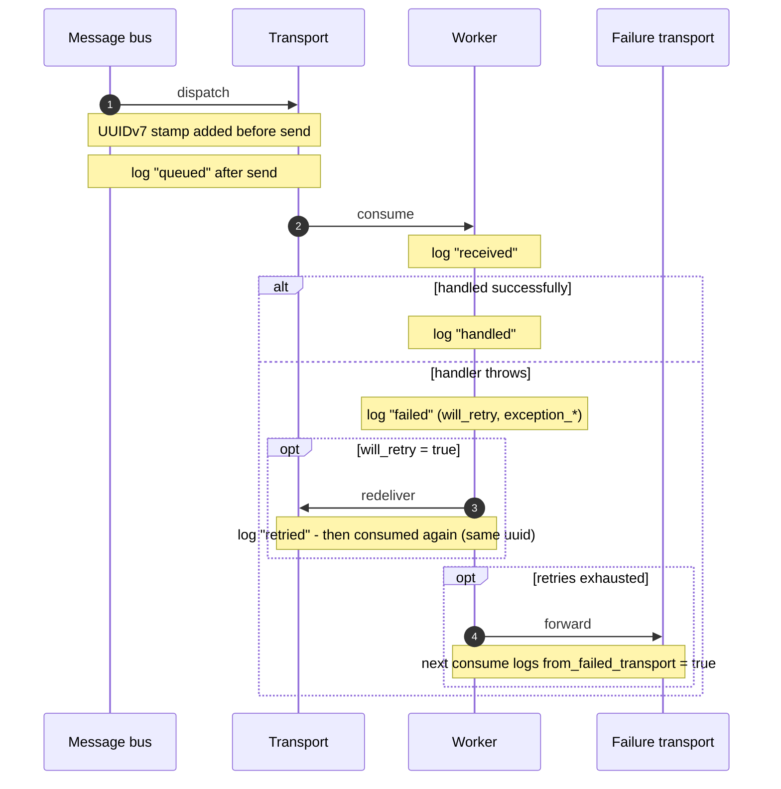

<p align="center">
  
</p>

# Messenger Logging Bundle

Symfony bundle focused on tracking individual Messenger messages end-to-end.

## Why This Bundle Exists

Symfony Messenger's internal logging is useful for worker-level diagnostics,
but it is not optimized for tracking a single message across queueing, retries,
failure transport, and final handling.

This bundle adds a stable `uuid` to each message and emits structured lifecycle
logs so one message can be followed reliably in your logging and monitoring
tools.

### Tracking Capabilities

- UUIDv7 assignment when a message is queued.
- Stable UUID reuse across queueing, receiving, handling, failures, retries.
- Structured log context with lifecycle fields, transport metadata, and
  normalized Messenger stamps.

## Installation

### Package Installation

```bash
composer require ckrack/messenger-logging-bundle
```

### Bundle Registration

If you are not using Symfony Flex, register the bundle manually in
`config/bundles.php`.

### Supported Versions

The bundle targets Symfony `7.4` and `8.0`.

## Configuration

### Basic Configuration

```yaml
ckrack_messenger_logging:
  enabled: true
  log_channel: messenger
  log_levels:
    queued: info
    received: info
    handled: info
    failed: error
    retried: warning
  stamp_normalizers: {}
```

### Log Levels

All PSR-3 log levels are supported. If failure logs are too noisy in a
retry-heavy environment, you can set `failed: info`. The `log_levels.*` keys
match the event names listed in [Logged Events](#logged-events).

### Dedicated Log Channel

If `log_channel` is set, only the logs emitted by this bundle are sent to that
Monolog channel. Other project logs remain unaffected unless they are
explicitly configured to use the same channel. Without `log_channel`, the
default logger behavior remains unchanged.

## Tracked Lifecycle

### Lifecycle Diagram



### Logged Events

Every worker subscriber back-fills a missing UUID before logging. Queueing,
receiving, handling, failure, and retry events are available in Symfony `7.4`
and `8.0`.

- **`SendMessageToTransportsEvent`** assigns the UUIDv7 stamp before sending,
  or reuses an existing one.
- **`MessageSentToTransportsEvent`** -> `Messenger message queued.` Level:
  `log_levels.queued`.
- **`WorkerMessageReceivedEvent`** -> `Messenger message received.` Level:
  `log_levels.received`.
- **`WorkerMessageHandledEvent`** -> `Messenger message handled.` Level:
  `log_levels.handled`.
- **`WorkerMessageFailedEvent`** -> `Messenger message failed.` Level:
  `log_levels.failed`.
- **`WorkerMessageRetriedEvent`** -> `Messenger message scheduled for retry.`
  Level: `log_levels.retried`.

Worker-level events (`WorkerStartedEvent`, `WorkerStoppedEvent`,
`WorkerRunningEvent`, `WorkerRateLimitedEvent`) are intentionally not logged.

## Log Context

```php
// Log context - every event, built by MessengerLogContextBuilder::build().
array{
    uuid: string|null,
    message_class: class-string,
    retry_count: int,
    received_transport_names: list<string>,
    from_failed_transport: bool,
    failed_transport_original_receiver_name: string|null,
    transport_message_id: string|null,
    stamps: list<array{class: class-string, context: array<string, mixed>}>,

    // Event-specific fields.
    sender_names?: list<string>,               // queued only
    receiver_name?: string,                    // received, handled, failed, retried
    will_retry?: bool,                         // failed only
    exception_class?: class-string<Throwable>, // failed only
    exception_message?: string,                // failed only
    exception_code?: string,                   // failed only
}
```

Example `failed` log context:

```json
{
  "uuid": "018f4f8f-4a73-7d3a-98f0-47b9d6ffb601",
  "message_class": "App\\Message\\ChargeCustomer",
  "retry_count": 2,
  "received_transport_names": ["async"],
  "from_failed_transport": false,
  "failed_transport_original_receiver_name": null,
  "transport_message_id": "01HXK4Y3W9Q8V7N6M5P4R3T2S1",
  "stamps": [
    {
      "class": "Symfony\\Component\\Messenger\\Stamp\\BusNameStamp",
      "context": {"bus_name": "messenger.bus.default"}
    },
    {
      "class": "Symfony\\Component\\Messenger\\Stamp\\RedeliveryStamp",
      "context": {"retry_count": 2}
    }
  ],
  "receiver_name": "async",
  "will_retry": true,
  "exception_class": "RuntimeException",
  "exception_message": "Payment provider timed out.",
  "exception_code": "0"
}
```

## Stamp Normalization

### Default Behavior

The bundle normalizes a safe subset of Messenger stamp data and includes it in
the `stamps` field of each log entry. Built-in normalizers cover
`BusNameStamp`, `DelayStamp`, `HandledStamp`, `RedeliveryStamp`,
`RouterContextStamp`, `SentStamp`, `TransportNamesStamp`, and
`ValidationStamp`.

Unknown stamps are still listed by class name, but their `context` remains
empty unless a normalizer is registered for them. This avoids reflecting every
public getter on every stamp, which can expose sensitive data or large payloads
such as handler results.

### Custom Normalizers

Custom normalizers are discovered automatically when they implement
`C10k\MessengerLoggingBundle\Logging\StampNormalizerInterface` and are
registered as autoconfigured services. The bundle tags them with
`ckrack_messenger_logging.stamp_normalizer` and maps them by supported stamp
class.

You can also wire an explicit `StampClass -> NormalizerClass` mapping via
configuration, which is useful for overrides:

```yaml
ckrack_messenger_logging:
  stamp_normalizers:
    App\Messenger\CustomStamp: App\Messenger\Logging\CustomStampNormalizer
```

## Local development

### Prerequisites

- Docker with Compose V2
- pre-commit
- GNU Make

### Common Commands

```bash
make setup
make check
make fix
```

`make setup` installs Composer dependencies and both the `pre-commit` and
`pre-push` hooks.
